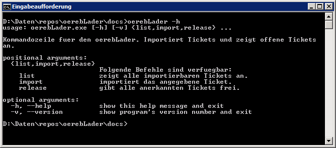

Benutzeranleitung
=================
Der oerebLader ist ein Kommandozeilen-Programm. Es exisitieren zwei Interfaces:

oerebLader
----------


checkBundesthemen
-----------------
Das Programm ```checkBundesthemen`` wird ohne Parameter aufgerufen. Es prüft, ob auf http://data.geo.admin.ch aktualisierte Datensätze vorliegen und erstellt einen Eintrag in der Tabelle TICKET.